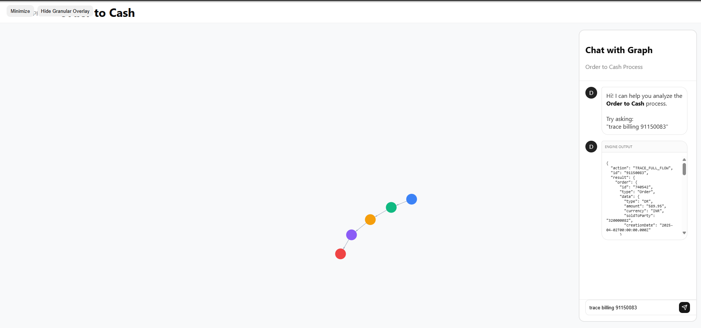
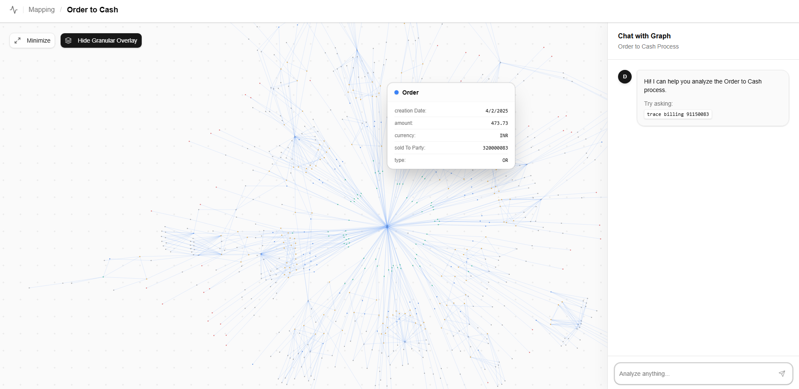

# Chat UI Refactor — Walkthrough

## Changes Made

All changes in [App.jsx](file:///c:/Users/Admin/new-ts/frontend/src/App.jsx):

- **Removed** "Engine Output" section and `JSON.stringify` fallback — zero raw JSON in UI
- **Added** `action` state to track query type from backend response
- **Added** [RenderResult](file:///c:/Users/Admin/new-ts/frontend/src/App.jsx#384-404) router — switch-based component that renders the right card per action
- **Added** [TopProductsCard](file:///c:/Users/Admin/new-ts/frontend/src/App.jsx#286-328) — ranked list with `#N` badges, monospace IDs, billing counts, and gradient bar visualization
- **Added** [BrokenFlowsCard](file:///c:/Users/Admin/new-ts/frontend/src/App.jsx#329-383) — anomaly display with amber/red indicators, count badges, and monospace IDs
- **Updated** [FormattedOutput](file:///c:/Users/Admin/new-ts/frontend/src/App.jsx#220-285) — now wrapped in a Card with "Trace Result" heading, prop renamed from `result` to `data`

## Early stage of UI

## Final UI

All three query types render clean, structured components with no raw JSON anywhere.
