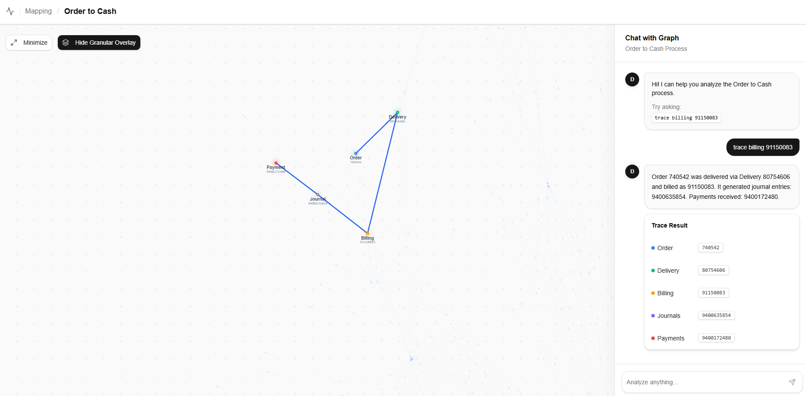
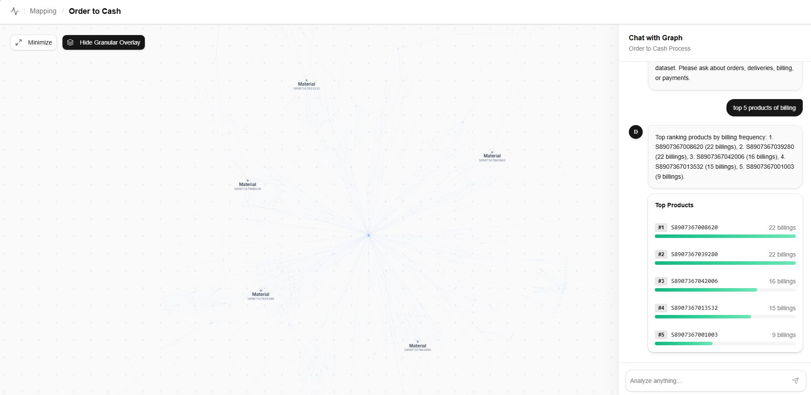
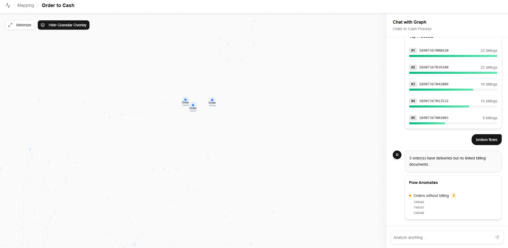

# Chat UI Refactor & Graph Glow Effects — Walkthrough

## Changes Made

All changes in [App.jsx](file:///c:/Users/Admin/new-ts/frontend/src/App.jsx):

### Chat UI Refactor (Previous)
- Removed "Engine Output" section and `JSON.stringify` fallback
- Added [RenderResult](file:///c:/Users/Admin/new-ts/frontend/src/App.jsx#438-458) router, [TopProductsCard](file:///c:/Users/Admin/new-ts/frontend/src/App.jsx#340-382), [BrokenFlowsCard](file:///c:/Users/Admin/new-ts/frontend/src/App.jsx#383-437)

### Graph Glow Effects (New)
- **Custom `nodeCanvasObject`**: Highlighted nodes render with concentric glow rings (12% and 25% alpha), scaled up to 10px radius (vs 8px default), and a white border stroke
- **Green highlighted edges**: Changed from gray to `#22c55e` with 2.5x link width
- **Animated directional particles**: 3 green particles flow along highlighted edges at 0.005 speed
- **Deep dimming**: Non-highlighted nodes/edges fade to near-invisible (`0.08` alpha for edges, `0.15` for nodes)
- **`nodePointerAreaPaint`**: Ensures click/hover detection works with custom canvas rendering

> [!NOTE]
> Existing features already in place: `highlightedIds` state, ID extraction from trace results, reset on new query, auto zoom-to-fit.

## Verification

### Trace query with graph glow

### Top Products (no graph, clean card)

### Broken Flows (anomaly card)
